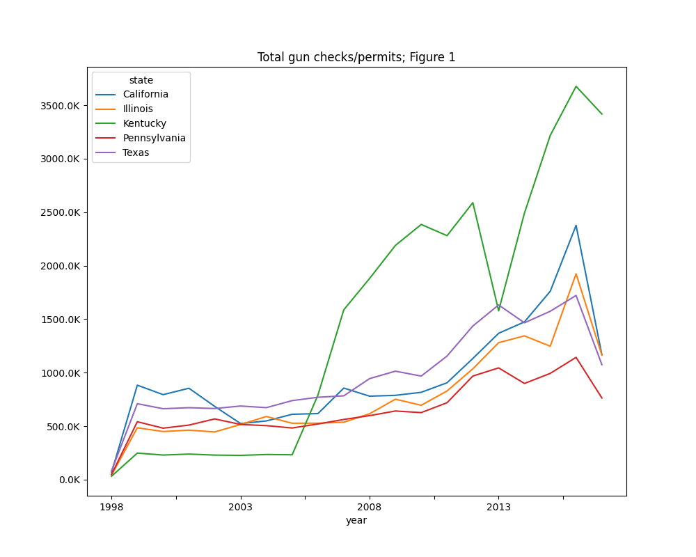
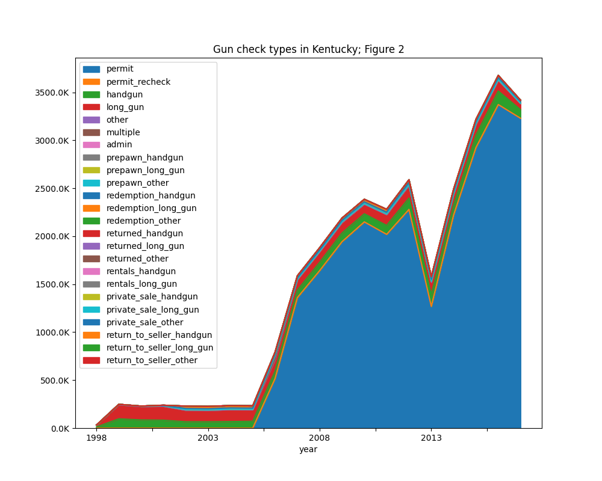
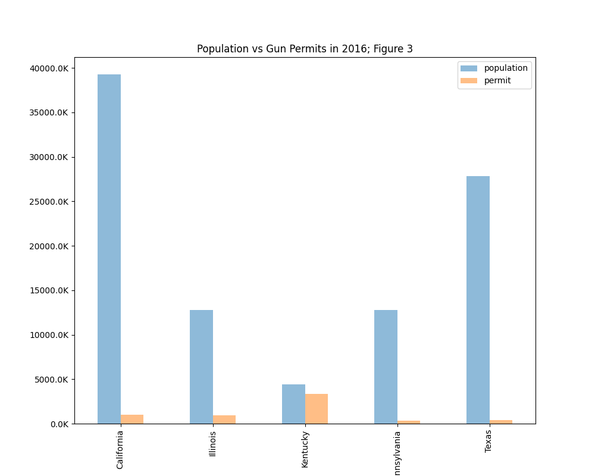
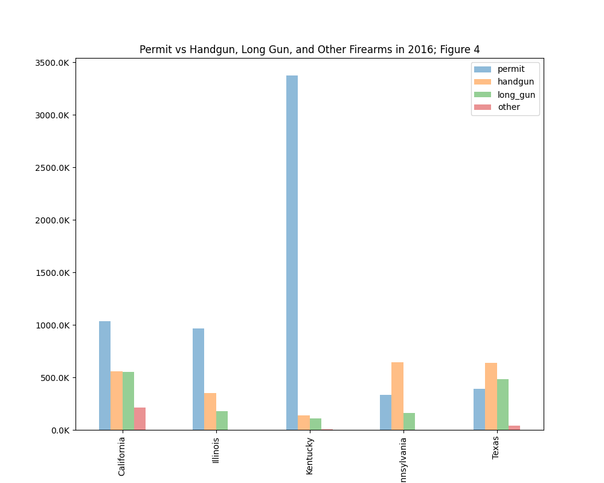

# REPORT #

### What data is used? ###

* [gun-data](https://d17h27t6h515a5.cloudfront.net/topher/2017/November/5a0a4db8_gun-data/gun-data.xlsx) from FBI's National Instant Criminal Background Check System (NICS).
* [census-data](https://d17h27t6h515a5.cloudfront.net/topher/2017/November/5a0a554c_u.s.-census-data/u.s.-census-data.csv)

### Investigation ###

Since data has lots of null values, we have to fill in these cells. O-filling makes sense here because we dont want to make false sum of checks/registrations
Then, extract year from month column and group data in year-wise will give better visualization.
Group data in year and state to find out top 5 states (https://stackoverflow.com/questions/31569549/how-to-groupby-a-dataframe-in-pandas-and-keep-columns)
Setting graph unit to thousands (https://stackoverflow.com/questions/53747298/how-to-format-seaborn-matplotlib-axis-tick-labels-from-number-to-thousands-or-mi)

* Which states (top 5) have most gun checks/registrations over years?

Below figure shows that California, Illinois, Kentucky, Pennsylvania, and Texas are the top 5 states that have the most gun checks/registrations over years.

* What are types of gun checks/registrations done in the top state?

Plot permit checks, registrations in top state to find out trend using area chart (https://pandas.pydata.org/docs/reference/api/pandas.DataFrame.plot.area.html)

From Figure 1, Kentucky seems to be top state that has highest gun check/registrations.
Below figure shows that permit checks takes the highest portion of gun checks followed by handgun registrations in Kentucky.

Overall, permit checks take largest volume in Kentucky since 2005 

* How is gun permits vs population in the top 5 States in 2016?

We need census data and transpose it following tips from https://knowledge.udacity.com/questions/713929 

Data in Kentucky in 2016 shows that gun permit number is nearly equal to population. Nearly, 1 person in Kentucky has 1 permit in 2016. Meanwhile, gun permits in other 4 states are relatively low comparing with population.

_Limitation:_ if we have data of permits in city vs rural areas, we can have better view of trend of gun owning in different areas or cities.

* How is gun permits vs handgun, long guns, other firearms in top 5 states in 2016?

Even though permits on population ratio is high in Kentucky; but handgun, long gun, and other registrations are very low. However, number of handguns and long guns seem to be twice number of permits in Texas. We can assume that at 1 person with permit in Texas can own a least 2 guns.

In addition, total of handguns and long guns in California in 2016 is equal to number of permits. We can assume that 1 person in California with permit can own either a handgun or a long gun.

While in Pennsylvania, 1 person with gun permit can own at least 2 handguns.

_Limitation:_ We do not know the age of gun owners and their gun references.
